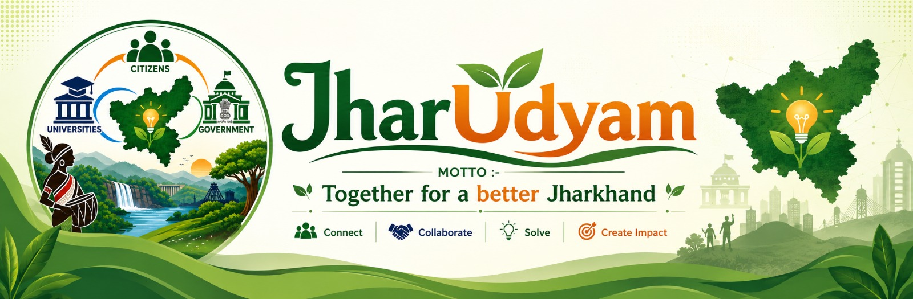
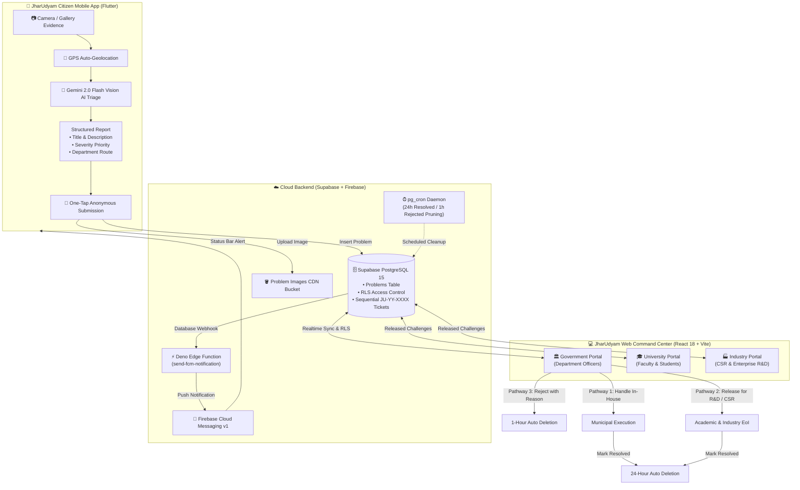
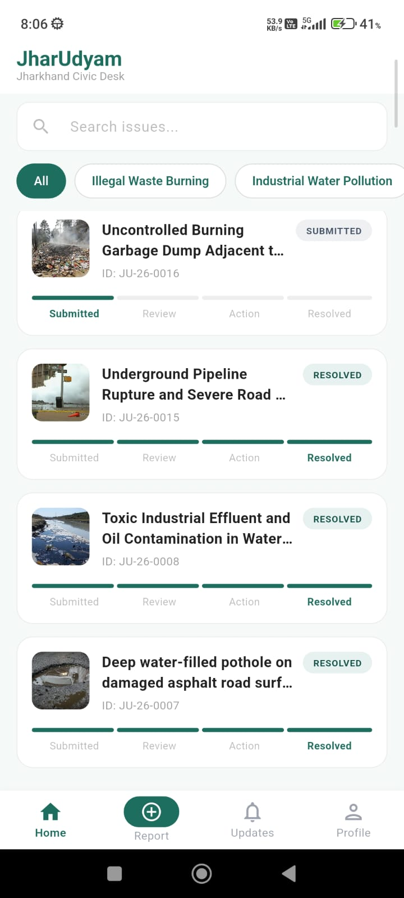
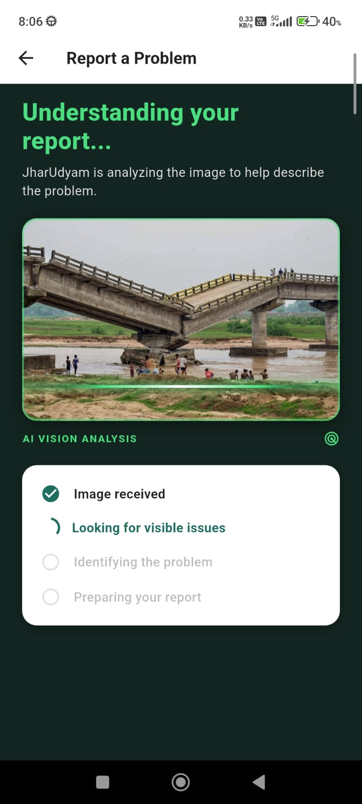
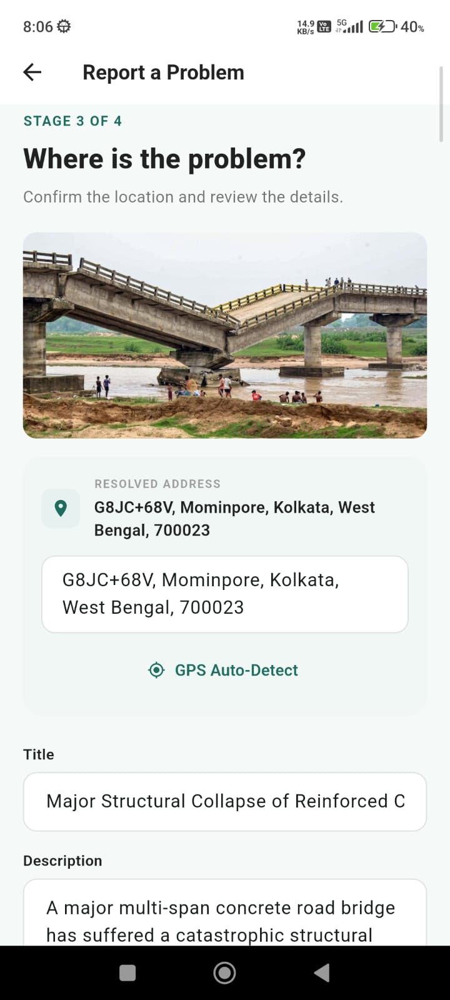
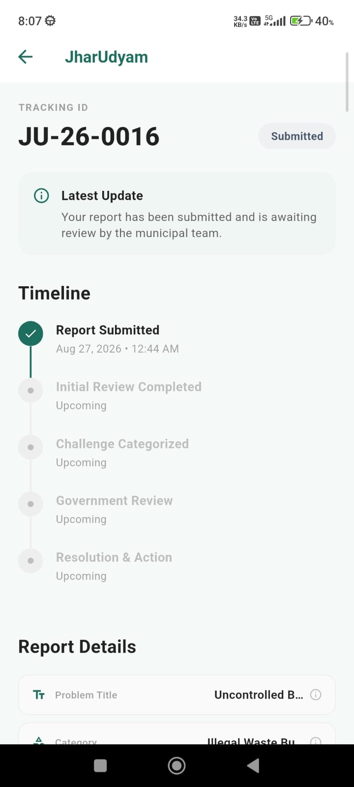
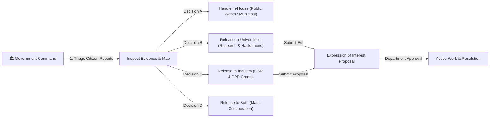

<div align="center">



# 🏛️ JharUdyam (झारउद्यम)
### *AI-Powered Societal Challenge Identification & Multi-Stakeholder Civic Resolution Network*

[](https://sih.gov.in)
[](https://sih.gov.in)
[](https://flutter.dev)
[](https://reactjs.org)
[](https://supabase.com)
[](https://ai.google.dev)
[](https://firebase.google.com)

**"Together for a better Jharkhand · Connect · Collaborate · Solve · Create Impact"**

</div>

---

## 📌 1. SIH Problem Statement & Project Overview

| Attribute | Details |
| :--- | :--- |
| **Problem Statement ID** | **SIH26043** |
| **Problem Title** | AI-Driven Societal Challenge Identification, Crowdsourcing, and Multi-Stakeholder Resolution Network |
| **Category** | Software |
| **Theme** | Smart Automation / Civic Technology / Government Administration & Societal Challenges |
| **Target Beneficiaries** | Citizens of Jharkhand, Government Departments, Universities & Academic Researchers, Industrial Partners & CSR Units |
| **Team Name** | **HexCoders** |

### 👥 Team HexCoders

| Name | Role | Core Focus Area |
| :--- | :--- | :--- |
| **Ankit Dey** | **Team Leader** | System Architecture, Full-Stack Integration & Project Management |
| **Sanchari Ganguly** | Core Developer | Web Command Center, UI/UX Design & Frontend Engineering |
| **Sandhya Poddar** | Core Developer | Database Architecture, Supabase PostgreSQL & RLS Security |
| **Farhan Naser** | Core Developer | Mobile App Development (Flutter), Gemini Vision AI & Push Notifications |
| **Debojyoti Dey** | Core Developer | Cloud Infrastructure, Edge Functions, Automation & Cron Engines |
| **Gaurav Paul** | Core Developer | Research, API Integration, Quality Assurance & Documentation |

---

## 🌟 2. Executive Summary & The Problem

Traditional civic grievance portals and municipal management systems suffer from critical structural bottlenecks:
1. **High Friction for Citizens:** Mandatory logins, OTP verifications, tedious text forms, and complex department classification discourage citizens from reporting real-world hazards.
2. **Manual Triage Bottlenecks:** Municipal officers spend thousands of hours manually reading, classifying, and filtering redundant or misallocated reports.
3. **Siloed Solutions:** Local governments lack a formal, systematic channel to broadcast complex engineering, environmental, and infrastructure challenges to academic researchers (universities) and private enterprise (CSR & industrial innovators).
4. **Data Stagnation & Storage Bloat:** Millions of resolved and invalid tickets clutter databases indefinitely without automated lifecycle pruning.

### 💡 The JharUdyam Solution
**JharUdyam** transforms societal problem resolution into an automated, transparent, and collaborative ecosystem:
- **Zero-Login Mobile Reporting:** Citizens point, snap a photo, and submit in seconds with zero authentication barrier.
- **Multimodal AI Vision Triage:** Google Gemini 2.0 Flash instantly analyzes photographic evidence, formulates structured titles/descriptions, calculates safety risk priority (`critical`, `high`, `medium`, `low`), and auto-routes to the exact government department.
- **Multi-Stakeholder Web Command Center:** Department officers manage in-house municipal resolution or release challenges to universities (academic R&D) and industries (CSR & private enterprise).
- **Automated Lifecycle & Storage Hygiene:** Database crons prune resolved tickets after 24 hours and rejected tickets after 1 hour, maintaining lean, high-speed infrastructure.
- **Real-Time Notification & Immutable Custody Trail:** Firebase Cloud Messaging (FCM v1) and Supabase Realtime keep citizens updated with end-to-end transparency.

---

## 🏗️ 3. End-to-End System Architecture



---

## 📱 4. Mobile Application Showcase (Flutter)

The JharUdyam Citizen mobile application provides a native, zero-friction reporting interface built in Flutter with Material Design 3 and custom civic styling.

| Home Feed & Live Tracking | Gemini AI Vision Inspection | Review & GPS Auto-Detect | Real-Time Issue Custody |
| :---: | :---: | :---: | :---: |
|  |  |  |  |
| *Real-time issue feed with active category filters & status badges* | *Gemini 2.0 Flash multi-step automated visual triage* | *Reverse-geocoded GPS address & AI auto-filled parameters* | *Complete lifecycle audit trail with interactive detail modals* |

### Mobile Key Highlights:
- **Zero-Login Architecture:** Device UUID persistence eliminates mandatory logins while preserving report ownership across sessions.
- **Multimodal AI Vision Triage:** Uploaded photos are inspected by Google Gemini 2.0 Flash to auto-populate Title, Description, Department, and Priority without user typing.
- **Interactive Detail Modals:** Clickable metadata chips with full-text inspection and clipboard copy.
- **Persistent Notifications & Deep Linking:** Push alerts and in-app notifications link directly to the affected ticket.
- **Sub-Second Native Bootup:** Pre-cached theme and animated scaling logo eliminate startup delay.

---

## 💻 5. Web Command Center Architecture (React 18 + Vite)

The **JharUdyam Web Portal** serves as the administrative command center for Government Departments, Universities, and Industry partners to review, adopt, and resolve societal challenges with an immutable chain of custody.



### Role-Based Portals:
1. **🏛️ Government Portal (`government`):**
   - **Department Scoping:** Filtered by assigned municipal departments (*Public Works, Water Supply & Sanitation, Electricity, Municipal Solid Waste, Health, Transport, Urban Development, Environment & Forests*).
   - **4 Decision Pathways:** In-House, University Release, Industry Release, or Broadcast to Both.
   - **Rejection Engine:** Transparent rejection logging with mandatory justification and automatic 1-hour pruning.
   - **Reconsideration Engine:** Ability to reopen or modify decisions with audit logging.
2. **🎓 University Portal (`university`):**
   - Public challenges marketplace for faculty, researchers, and student innovators.
   - Formal submission of **Expressions of Interest (EoI)** detailing methodology, timeline, and deliverables.
3. **🏭 Industry Portal (`industry`):**
   - Marketplace for private sector contractors, infrastructure enterprises, and CSR funds.
   - Capability proposal submissions for public-private partnership (PPP) execution.

---

## 🗄️ 6. Supabase Database Schema & Data Contracts

### A. Core Enums
```sql
-- 1. Portal User Roles
create type public.user_role as enum ('government', 'university', 'industry');

-- 2. Problem Lifecycle Status
create type public.problem_status as enum (
  'submitted',            -- Citizen submitted, AI classified
  'under_review',         -- Department opened ticket
  'government_handling',  -- Department handling internally
  'released',             -- Department released for collaboration
  'interest_expressed',   -- University / Industry expressed interest
  'in_progress',          -- Active on-ground work in progress
  'resolved',             -- Completed (auto-deleted after 24h)
  'rejected'              -- Rejected with reason (auto-deleted after 1h)
);

-- 3. Release Scope
create type public.release_scope as enum ('none', 'university', 'industry', 'both');

-- 4. Priority Levels
create type public.priority_level as enum ('low', 'medium', 'high', 'critical');
```

### B. `public.problems` Table Contract
```sql
create table public.problems (
  id uuid primary key default gen_random_uuid(),
  ticket_no text unique not null,
  title text not null,
  description text not null,
  category text not null,
  priority public.priority_level not null default 'medium',
  department text not null,
  image_url text not null,
  image_path text not null,
  address text not null,
  latitude double precision not null,
  longitude double precision not null,
  reporter_id text not null,
  reporter_name text default 'Citizen report · mobile app',
  status public.problem_status not null default 'submitted',
  released_to public.release_scope default 'none',
  released_at timestamptz,
  resolved_at timestamptz,
  rejected_at timestamptz,
  rejection_reason text,
  government_note text,
  created_at timestamptz not null default now(),
  updated_at timestamptz not null default now()
);
```

### C. Automated Sequential Ticket Generation (`JU-YY-XXXX`)
```sql
create sequence if not exists public.problem_ticket_seq start with 1 increment by 1;

create or replace function public.problems_before_write()
returns trigger language plpgsql as $$
begin
  if new.ticket_no is null then
    new.ticket_no := 'JU-' || to_char(now(), 'YY') || '-' ||
                     lpad(nextval('public.problem_ticket_seq')::text, 4, '0');
  end if;

  if new.status = 'resolved' and (old is null or old.status is distinct from 'resolved') then
    new.resolved_at := now();
  elsif new.status <> 'resolved' then
    new.resolved_at := null;
  end if;

  if new.status = 'rejected' and (old is null or old.status is distinct from 'rejected') then
    new.rejected_at := now();
  elsif new.status <> 'rejected' then
    new.rejected_at := null;
  end if;

  new.updated_at := now();
  return new;
end;
$$;

create trigger trg_problems_before_write
before insert or update on public.problems
for each row execute function public.problems_before_write();
```

### D. Automated Self-Cleaning Engine (`pg_cron`)
```sql
create or replace function public.delete_expired_problems()
returns int language plpgsql security definer set search_path = public as $$
declare
  resolved_deleted int := 0;
  rejected_deleted int := 0;
begin
  -- 1. Delete resolved problems older than 24 hours
  delete from public.problems
  where status = 'resolved'
    and resolved_at is not null
    and resolved_at < (now() - interval '24 hours');
  get diagnostics resolved_deleted = row_count;

  -- 2. Delete rejected problems older than 1 hour
  delete from public.problems
  where status = 'rejected'
    and rejected_at is not null
    and rejected_at < (now() - interval '1 hour');
  get diagnostics rejected_deleted = row_count;

  return resolved_deleted + rejected_deleted;
end;
$$;

-- Scheduled background cron daemon running every 5 minutes
select cron.schedule(
  'cleanup-expired-problems',
  '*/5 * * * *',
  $$select public.delete_expired_problems();$$
);
```

---

## 🛠️ 7. Tech Stack & Technologies Used

```
┌─────────────────────────────────────────────────────────────────────────────┐
│                           JHARUDYAM TECH STACK                              │
├───────────────────┬─────────────────────────────────────────────────────────┤
│ Layer             │ Technologies & Libraries                                │
├───────────────────┼─────────────────────────────────────────────────────────┤
│ Mobile App        │ Flutter 3.x, Dart 3.x, Provider, Material 3             │
│ Web Command Center│ React 18, Vite 5, Tailwind CSS, PostCSS, React Router v6│
│ AI Vision Engine  │ Google Gemini 2.0 Flash Multimodal Vision API           │
│ Backend Database  │ Supabase (PostgreSQL 15), Postgres Sequences & Triggers │
│ Cloud Storage     │ Supabase Storage (S3-compatible CDN Bucket)             │
│ Push Notifications│ Firebase Cloud Messaging (FCM v1), Supabase Webhooks    │
│ Serverless / Edge │ Deno TypeScript Edge Functions                          │
│ Cron & Automation │ pg_cron background scheduler, PL/pgSQL Daemons          │
│ Maps & Geolocation│ OpenStreetMap / Leaflet, Geolocator, Geocoding          │
│ DevOps & Hosting  │ Git, GitHub, Render Static Web Hosting                  │
└───────────────────┴─────────────────────────────────────────────────────────┘
```

---

## 🚀 8. Installation & Setup Guide

### A. Prerequisites
- **Flutter SDK**: `^3.11.3` or higher
- **Node.js**: `18.x` or higher & `npm`
- **Android Studio / Xcode** (for mobile development)
- **Supabase Account** & **Firebase Project**

---

### B. Mobile App Setup (Flutter)

1. **Clone the repository:**
   ```bash
   git clone https://github.com/nonsense3/SIH26043-crowdsource.git
   cd SIH26043-crowdsource/App
   ```

2. **Install Flutter dependencies:**
   ```bash
   flutter pub get
   ```

3. **Configure Firebase:**
   - Place your `google-services.json` in `App/android/app/google-services.json`.

4. **Run on connected device or emulator:**
   ```bash
   flutter run --dart-define=GEMINI_API_KEY=YOUR_GEMINI_API_KEY_HERE
   ```

---

### C. Web Command Center Setup (React + Vite)

1. **Navigate to the web portal directory:**
   ```bash
   cd SIH26043-crowdsource/Web
   ```

2. **Install dependencies:**
   ```bash
   npm install
   ```

3. **Configure environment variables (`.env`):**
   ```env
   VITE_SUPABASE_URL=https://your-project.supabase.co
   VITE_SUPABASE_ANON_KEY=your-supabase-anon-key
   ```

4. **Start local development server:**
   ```bash
   npm run dev
   ```

5. **Build for production:**
   ```bash
   npm run build
   ```

---

## 🔮 9. Future Scope & Scaling Capabilities

1. **🎙️ Multilingual Voice-to-Text Reporting:** Support for regional tribal and local languages (*Santhali, Ho, Mundari, Khortha, Nagpuri, Hindi*) enabling accessibility for non-literate citizens.
2. **📡 Offline Mesh Network Sync:** Store-and-forward mechanism over Bluetooth Low Energy (BLE) / WiFi Direct for remote tribal areas with zero cellular connectivity.
3. **🚁 AI Drone & Municipal Dashcam Feeds:** Automated road quality indexing and hazard detection via edge computer vision.
4. **🔗 Blockchain Verification for Invoices:** Smart contract-based milestones ensuring contractor payments are unlocked only after verified community resolution.
5. **🗺️ State-Wide GIS Heatmaps:** Predictive analytics forecasting seasonal waterlogging, pipe bursts, and waste accumulation before escalation.

---

## 📜 10. License & Acknowledgments

This project is developed by **Team HexCoders** for the **Smart India Hackathon (SIH 2026)** under Problem Statement **SIH26043**.

Special thanks to:
- **Ministry of Education's Innovation Cell (MIC)** & **AICTE**
- **Government of Jharkhand**
- **Google Cloud & Gemini AI** for multimodal intelligence support
- **Supabase & Firebase** for backend and push notification infrastructure

---

<div align="center">
<b>Made with ❤️ by Team HexCoders for Smart India Hackathon 2026</b>
</div>
